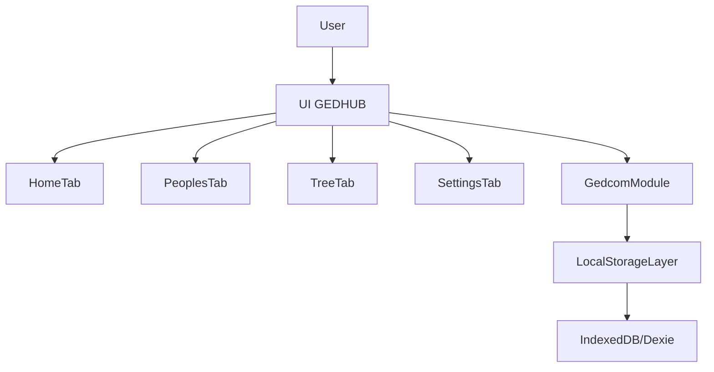

## GEDHUB – Spesifikasi Awal

GEDHUB adalah aplikasi **silsilah keturunan (genealogy)** yang berfokus pada **offline‑first app** dengan dukungan penuh terhadap format **GEDCOM**. Aplikasi ini ditujukan untuk membantu pengguna membangun dan mengelola pohon keluarga dengan antarmuka yang **clean**, **minimalis**, dan modern, terinspirasi dari desain library seperti `shadcn/ui` dan `Radix UI`.

Fitur dan konsep aplikasi banyak terinspirasi dari aplikasi **My Family Tree** dari Chronoplex Software [`My Family Tree`](https://chronoplexsoftware.com/myfamilytree/index.htm), namun GEDHUB akan dibangun dengan fokus pada arsitektur offline‑first dan extensibility untuk pengembangan selanjutnya.

---

## Tujuan & Sasaran

- **Offline‑first**: seluruh data utama (orang, keluarga, event, sumber) tersimpan secara lokal di perangkat pengguna dan dapat diakses tanpa koneksi internet.
- **Kompatibel GEDCOM**: mendukung import, export, dan pembuatan file GEDCOM baru sebagai format interoperabilitas dengan aplikasi genealogis lain.
- **Mendukung data besar & relasi kompleks**: mampu menangani ribuan hingga puluhan ribu individu dengan hubungan keluarga multi‑generasi dan pernikahan ganda.
- **UI clean & minimalis**: pengalaman pengguna yang sederhana, modern, dengan fokus pada keterbacaan dan kemudahan navigasi.

Target platform awal dijelaskan secara netral (web/desktop offline), namun desain UI mengacu pada ekosistem komponen modern ala `shadcn/ui` dan `Radix UI` (mis. stack React + Tailwind atau sejenisnya).

---

## Stack & Library Flutter (Rencana)

Untuk implementasi aplikasi Flutter (`gedhub_app`), beberapa library akan digunakan ketika dibutuhkan untuk menjaga arsitektur tetap bersih, testable, dan ekspresif:

- **Dio + Retrofit**: untuk HTTP client dan deklarasi API berbasis interface (digunakan nanti saat ada kebutuhan sinkronisasi/backup online atau layanan eksternal).
- **Freezed**: untuk data class/union type yang immutable dan memiliki `copyWith`, equality, dan codegen yang kuat (model domain, DTO, state).
- **GoRouter**: untuk manajemen routing dan navigasi yang deklaratif, terutama ketika aplikasi bertumbuh menjadi multi‑screen yang kompleks.
- **Riverpod**: sebagai state management utama (dependency injection + reactive state) menggantikan pengelolaan state manual atau `Provider` dasar.
- **Dartz**: untuk tipe fungsional seperti `Either`, `Option`, dsb. yang membantu memodelkan hasil operasi (sukses/gagal) secara eksplisit di domain layer.

Library‑library ini akan diadopsi secara bertahap sesuai kebutuhan fitur (tidak semuanya harus diaktifkan sekaligus di awal).

---

## Fitur Utama GEDCOM

### 1. Import GEDCOM

- **Tujuan**: mengimpor data silsilah yang sudah ada dari file `.ged` ke dalam basis data lokal GEDHUB.
- **Spesifikasi awal**:
  - Minimal mendukung **GEDCOM 5.5 / 5.5.1** sebagai target awal.
  - Direncanakan untuk dikembangkan ke **GEDCOM 7.x** di fase selanjutnya.
  - Import dilakukan dari **file lokal** (offline), tanpa ketergantungan server.
- **Perilaku dasar**:
  - Validasi ukuran file (mis. batas awal konservatif, namun dirancang agar bisa skala ke file besar).
  - Validasi struktur dasar GEDCOM (tag penting: `INDI`, `FAM`, `SOUR`, `NOTE`, dsb).
  - Menampilkan ringkasan hasil import: jumlah individu, keluarga, event, dan peringatan jika ada data yang di-skip atau tidak dikenali.

### 2. Export GEDCOM

- **Tujuan**: mengekspor data yang tersimpan di GEDHUB menjadi file `.ged` yang kompatibel dengan aplikasi lain.
- **Spesifikasi awal**:
  - Ekspor **seluruh basis data aktif** menjadi satu file GEDCOM.
  - Menghasilkan struktur yang kompatibel minimal dengan GEDCOM 5.5/5.5.1.
- **Future enhancement** (dicatat di sini sebagai arah pengembangan):
  - Opsi eksport subset:
    - Hanya individu tertentu.
    - Subtree (ancestors/descendants dari seseorang).
  - Opsi kontrol privasi (menyembunyikan data orang yang masih hidup, menyamarkan detail sensitif, dsb).

### 3. Create New GEDCOM

- **Tujuan**: memulai pohon keluarga baru dari nol.
- **Perilaku dasar**:
  - Membuat **project**/database baru yang kosong.
  - Input awal:
    - Nama project (mis. “Keluarga Besar XYZ”).
    - Deskripsi singkat project.
    - Locale/tanggal default (mis. format tanggal, zona waktu).
  - Menyiapkan struktur internal (database lokal) sehingga pengguna dapat langsung menambah orang, keluarga, dan event.

---

## Model Data & Penyimpanan

### Prinsip Umum

- **Offline‑first**: seluruh operasi create, read, update, delete dilakukan terhadap storage lokal.
- **Mendukung data besar**:
  - Dirancang untuk **ribuan hingga puluhan ribu individu**.
  - Query yang umum (pencarian orang, navigasi pohon keluarga) harus tetap responsif.
- **Relasi kompleks**:
  - Multi generasi (kakek, buyut, dst).
  - Multiple marriages, adopsi, half‑siblings, dan variasi hubungan keluarga lainnya.

### Strategi Penyimpanan (Storage Strategy)

Untuk implementasi awal pada platform web/desktop berbasis teknologi web (mis. React + Electron/Tauri), penyimpanan diposisikan sebagai berikut:

- **Pilihan utama: IndexedDB dengan wrapper (mis. Dexie.js)**  
  Alasan pemilihan:
  - IndexedDB dirancang untuk **penyimpanan data besar** (hingga skala MB–GB) di sisi browser.
  - Mendukung beberapa object store dengan **index** dan **transaksi**, sehingga cukup untuk memodelkan relasi kompleks (Person, Family, Event, dll) secara efisien.
  - Sangat cocok untuk **offline‑first** karena sepenuhnya lokal dan tidak membutuhkan server.
  - Wrapper seperti **Dexie.js** mempermudah:
    - Definisi skema (versioning).
    - Query yang lebih ekspresif.
    - Transaksi yang aman dan lebih mudah dibaca.

- **Alternatif jangka menengah: SQLite embedded**  
  Dicatat sebagai opsi untuk:
  - Implementasi **native/desktop** di masa depan (mis. app berbasis Tauri, .NET, atau platform lain yang mendukung SQLite embedded).
  - Kebutuhan query relasional yang lebih kompleks (JOIN multi‑tabel, agregasi berat).
  - Migrasi dari IndexedDB dapat direncanakan dengan pemetaan skema yang jelas (`Person`, `Family`, `Event`, `Source`, dll).

### Sketsa Entitas Utama (Konseptual)

Deskripsi singkat (bukan skema teknis final):

- **`Person`**
  - Identitas individu.
  - Contoh atribut:
    - `id`
    - `givenName`, `surname`, `nickname`
    - `gender`
    - `birthDate`, `deathDate`
    - `birthPlace`, `deathPlace`
    - `notes` singkat.
  - Mapping GEDCOM: tag `INDI` dan sub‑tag terkait (NAME, BIRT, DEAT, dsb).

- **`Family`**
  - Mewakili unit keluarga (pasangan dan anak‑anak).
  - Contoh atribut:
    - `id`
    - `husbandId`, `wifeId` (atau pasangan 1/pasangan 2, dengan dukungan model keluarga yang lebih fleksibel).
    - `childrenIds[]`
  - Mapping GEDCOM: tag `FAM` dan sub‑tag terkait (HUSB, WIFE, CHIL, MARR, dsb).

- **`Event`**
  - Peristiwa yang terjadi pada `Person` atau `Family` (mis. kelahiran, pernikahan, kematian, pindah tempat).
  - Contoh atribut:
    - `id`
    - `type` (BIRTH, MARRIAGE, DEATH, ...).
    - `date`, `place`
    - `notes`
    - `personId` atau `familyId` sebagai foreign key.
  - Mapping GEDCOM: tag event seperti `BIRT`, `MARR`, `DEAT`, dsb.

- **`Source` & `Citation`** (future enhancement)
  - Menyimpan sumber data (buku, dokumen, arsip, URL offline, dll) dan kaitannya dengan `Person`/`Event`.
  - Mapping GEDCOM: `SOUR`, `PAGE`, `QUAY`, dsb.

Struktur ini dirancang agar:

- Dapat dipetakan dengan jelas ke dan dari struktur GEDCOM (`INDI`, `FAM`, `SOUR`, dll).
- Dapat dioptimalkan dengan index di IndexedDB (mis. index pada `surname`, `givenName` untuk pencarian orang).

---

## Arsitektur Fungsional Offline‑First (High Level)

Secara garis besar, alur kerja aplikasi offline‑first adalah sebagai berikut:

- UI berinteraksi dengan **modul GEDCOM** dan **lapisan storage lokal**.
- Semua operasi (create, update, delete, import, export) hanya menyentuh storage lokal (IndexedDB atau yang setara).
- Pengguna dapat melakukan **backup/restore** melalui:
  - Export GEDCOM.
  - (Future) format lain seperti gedzip/arsip database.

Diagram high‑level:

---

## Struktur Menu / Tab Utama

Aplikasi memiliki 4 menu/tab utama:

1. **Home**
2. **Peoples**
3. **Tree (Family Chart)**
4. **Settings**

### 1. Home

- **Fungsi utama**:
  - **Create New GEDCOM** (membuat project/pohon baru dari nol).
  - **Import GEDCOM** (memasukkan data dari file `.ged` yang sudah ada).
  - **Export GEDCOM** (menyimpan data saat ini ke file `.ged`).
- **Konsep UI**:
  - Layout **kartu/tile** minimalis:
    - Satu kartu untuk masing‑masing aksi utama (Create, Import, Export).
    - Icon sederhana + judul + deskripsi singkat pada tiap kartu.
  - Tombol aksi besar dan jelas, mudah diakses (accessible).
  - (Future) Seksi “Recent projects” yang menampilkan project terakhir dibuka.

### 2. Peoples

- **Fungsi utama**:
  - Menampilkan daftar seluruh individu di database.
  - Menyediakan **search** dan **filter** dasar (mis. berdasarkan nama, marga, tahun lahir).
- **Fitur dasar**:
  - Tabel/list individu:
    - Kolom utama: Nama lengkap, tahun lahir, tahun wafat (jika ada), jumlah relasi keluarga.
  - Aksi:
    - Tambah orang baru.
    - Edit data individu.
    - Hapus individu (dengan konfirmasi dan pengecekan relasi).
    - Navigasi langsung ke tampilan **Tree** untuk individu yang dipilih.
- **Performa & UX**:
  - Dirancang untuk **data besar**:
    - Menggunakan **pagination** atau **virtual scrolling** agar scrolling tetap halus.
    - Pencarian cepat berbasis index pada `givenName`/`surname`.
  - Fokus pada keterbacaan:
    - Typografi yang jelas, jarak antar baris cukup lapang, icon sederhana.

### 3. Tree (Family Chart)

- **Fungsi utama**:
  - Menampilkan visual **pohon keluarga**:
    - Tampilan ancestor/descendant dari individu terpilih.
    - Mampu berpindah fokus ke individu lain di tree.
- **Fitur dasar**:
  - **Zoom** dan **pan**:
    - Pengguna dapat memperbesar/memperkecil dan menggeser view tree.
  - Node individu:
    - Menampilkan nama dan ringkasan (mis. tahun lahir/wafat).
    - Klik pada node membuka panel detail atau navigasi ke tab Peoples.
  - Level awal:
    - Fokus pada representasi sederhana (tanpa semua fitur lanjutan seperti variasi tipe chart kompleks).
  - Terinspirasi dari interaksi tree di `My Family Tree`, tetapi dengan UI minimalis.

### 4. Settings

- **Status awal**: **placeholder/blank** (belum ada pengaturan fungsional).
- **Rencana isi di masa depan**:
  - Pengaturan lokasi penyimpanan lokal/backup.
  - Pengaturan bahasa/locale dan format tanggal.
  - Preferensi tampilan (tema terang/gelap, ukuran font, dsb).

---

## Konsep UI & UX

### Pendekatan Desain

- **Clean, minimalis, modern**:
  - Palet warna sederhana (mode terang default, kontras baik).
  - Banyak white space untuk menjaga fokus.
  - Typografi sederhana dan konsisten.
- Terinspirasi dari:
  - `shadcn/ui`
  - `Radix UI`
  - Komponen dengan:
    - State hover/focus yang jelas.
    - Transisi halus namun subtil (tidak berlebihan).

### Prinsip UX

- **Simplicity first**:
  - Pengguna pemula genealogis dapat langsung:
    - Membuat project baru.
    - Menambah orang.
    - Melihat tree sederhana.
- **Aksi utama selalu jelas**:
  - Home menonjolkan 3 aksi utama (Create, Import, Export).
  - Di tiap tab, CTA (call‑to‑action) utama terbaca jelas.
- **Feedback yang eksplisit**:
  - Saat import/export GEDCOM:
    - Menampilkan progress (jika file besar).
    - Menampilkan ringkasan sukses/gagal.
    - Menampilkan daftar peringatan jika ada data tidak sempurna.
- **Aksesibilitas**:
  - Kontras warna yang baik.
  - Navigasi keyboard.
  - Struktur heading dan landmark yang semantik (untuk screen reader) direncanakan sejak awal.

---

## Roadmap Awal

- **M1 – Skeleton App**
  - Setup project.
  - Implementasi struktur tab (Home, Peoples, Tree, Settings).
  - Tombol/aksi stub untuk Create, Import, Export GEDCOM (belum full logic).

- **M2 – Storage & Model Dasar**
  - Implementasi lapisan storage offline berbasis IndexedDB (mis. Dexie).
  - Definisi model dasar `Person`, `Family`, `Event`.
  - Integrasi create/update/delete sederhana dari UI ke storage.

- **M3 – Peoples List & Detail**
  - Implementasi list individu (tabel/list) dengan search/filter dasar.
  - Form tambah/edit orang yang terhubung ke model dan storage.

- **M4 – Tree View Dasar**
  - Implementasi tampilan tree sederhana (ancestor/descendant).
  - Navigasi antar individu melalui tree.

Roadmap ini bersifat awal dan dapat diperluas seiring kebutuhan baru (mis. dukungan GEDCOM 7, sumber & citasi, statistik keluarga, laporan, dan fitur lanjutan lainnya).

