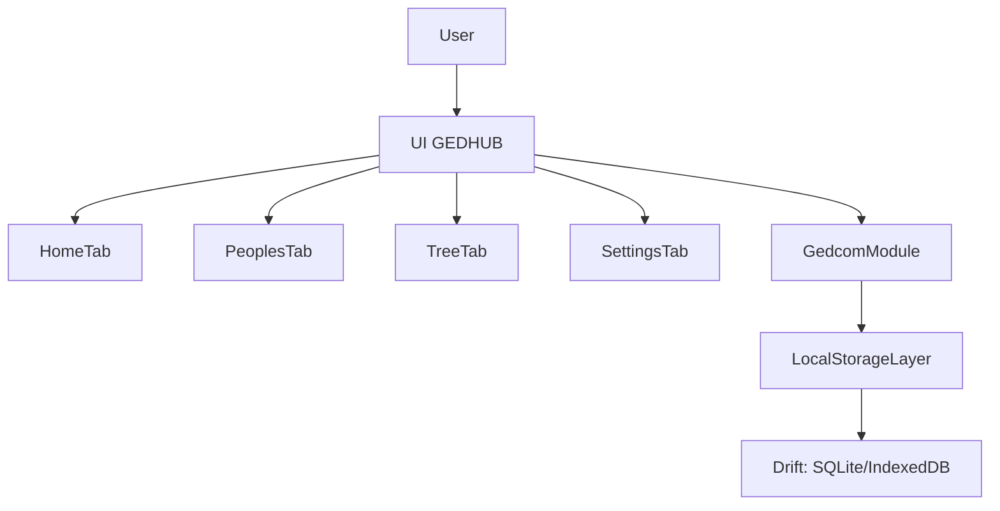

## GEDHUB – Spesifikasi Awal

GEDHUB adalah aplikasi **silsilah keturunan (genealogy)** yang berfokus pada **offline‑first app** dengan dukungan penuh terhadap format **GEDCOM**. Aplikasi ini ditujukan untuk membantu pengguna membangun dan mengelola pohon keluarga dengan antarmuka yang **clean**, **minimalis**, dan modern, terinspirasi dari desain library seperti `shadcn/ui` dan `Radix UI`.

Fitur dan konsep aplikasi banyak terinspirasi dari aplikasi **My Family Tree** dari Chronoplex Software [`My Family Tree`](https://chronoplexsoftware.com/myfamilytree/index.htm), namun GEDHUB akan dibangun dengan fokus pada arsitektur offline‑first dan extensibility untuk pengembangan selanjutnya.

---

## Tujuan & Sasaran

- **Offline‑first**: seluruh data utama (orang, keluarga, event, sumber) tersimpan secara lokal di perangkat pengguna dan dapat diakses tanpa koneksi internet.
- **Kompatibel GEDCOM**: mendukung import, export, dan pembuatan file GEDCOM baru sebagai format interoperabilitas dengan aplikasi genealogis lain.
- **Mendukung data besar & relasi kompleks**: mampu menangani ribuan hingga puluhan ribu individu dengan hubungan keluarga multi‑generasi dan pernikahan ganda.
- **UI clean & minimalis**: pengalaman pengguna yang sederhana, modern, dengan fokus pada keterbacaan dan kemudahan navigasi.

Target platform awal dijelaskan secara netral (web/desktop offline), namun desain UI mengacu pada ekosistem komponen modern ala `shadcn/ui` dan `Radix UI` (mis. stack React + Tailwind atau sejenisnya).

---

## Stack & Library Flutter

Untuk implementasi aplikasi Flutter (`gedhub`), beberapa library digunakan (dan sebagian lagi direncanakan) untuk menjaga arsitektur tetap bersih, testable, dan ekspresif:

- **Riverpod (flutter_riverpod)** – **SUDAH digunakan** sebagai state management & dependency injection utama:
  - `ProviderScope` membungkus `GedhubApp`.
  - Provider inti:
    - `appDatabaseProvider` – menyediakan instance `AppDatabase`.
    - `projectsRepositoryProvider` – menyediakan akses ke repository project.
    - `projectsStreamProvider` – menyediakan stream daftar project GEDCOM.
    - `currentProjectIdProvider` – menyimpan ID project GEDCOM yang saat ini aktif (untuk switching multi‑project).
  - Provider disusun menggunakan **pola anotasi `@riverpod`** dari paket `riverpod_annotation`:
    - Contoh pola definisi:

      ```dart
      @riverpod
      ProjectsRepository projectsRepository(ProjectsRepositoryRef ref) {
        final db = ref.watch(appDatabaseProvider);
        return ProjectsRepository(db);
      }
      ```

    - Codegen (`riverpod_generator` + `build_runner`) akan menghasilkan file `app_providers.g.dart` yang mendefinisikan provider dengan nama `projectsRepositoryProvider`, `projectsStreamProvider`, dst.
    - Dengan pola ini, penamaan provider konsisten dan siap dikembangkan (auto‑disposal, refactor aman, dsb.).
- **flutter_hooks & hooks_riverpod** – **SUDAH digunakan** untuk menggabungkan hooks dengan Riverpod:
  - `HookWidget` dipakai di `_MainShell` (tab index) dan `_LocaleSelector` (state preset locale).
  - `HookConsumerWidget` dipakai di `HomePage`, `_CreateProjectFormContent`, `_EditProjectFormContent`, `SettingsPage`, `DriftTableDataPage`, `SharedPrefsInspectorPage`.
  - `useState`, `useEffect`, `useTextEditingController`, `useMemoized` dipakai untuk state lokal dan lifecycle (controller form di dialog auto-dispose saat dialog ditutup).
- **Drift** – digunakan untuk persistence lokal berbasis SQLite/IndexedDB (via `AppDatabase` dan tabel `Projects`, dengan skema selaras DDL di direktori `supports/`):
  - Menggunakan anotasi Drift:
    - `@DataClassName('ProjectRow')` pada `Projects` untuk mengontrol nama data class yang di‑generate.
    - `@DriftDatabase(tables: [Projects])` pada `AppDatabase` untuk mendefinisikan database utama.
  - File `app_database.dart` menyertakan `part 'app_database.g.dart';` dan membutuhkan codegen (`drift_dev` + `build_runner`) untuk menghasilkan implementasi (`_$AppDatabase`, accessor `projects`, helper seperti `into`/`select`, dsb.).
- **Dio + Retrofit** – direncanakan untuk HTTP client dan deklarasi API berbasis interface (mis. sinkronisasi/backup online di masa depan).
- **Freezed** – direncanakan untuk data class/union type immutable dengan `copyWith`, equality, dan codegen (model domain, DTO, state).
- **GoRouter** – direncanakan untuk manajemen routing dan navigasi deklaratif ketika aplikasi bertumbuh menjadi multi‑screen yang lebih kompleks.
- **Dartz** – direncanakan untuk tipe fungsional seperti `Either`, `Option`, dsb., agar hasil operasi (sukses/gagal) dapat dimodelkan eksplisit di domain layer.

Library yang \"direncanakan\" akan diadopsi secara bertahap sesuai kebutuhan fitur (tidak semuanya harus diaktifkan sekaligus di awal).

---

## Fitur Utama GEDCOM

### 1. Import GEDCOM

- **Tujuan**: mengimpor data silsilah yang sudah ada dari file `.ged` ke dalam basis data lokal GEDHUB.
- **Spesifikasi awal**:
  - Minimal mendukung **GEDCOM 5.5 / 5.5.1** sebagai target awal.
  - Direncanakan untuk dikembangkan ke **GEDCOM 7.x** di fase selanjutnya.
  - Import dilakukan dari **file lokal** (offline), tanpa ketergantungan server.
- **Perilaku dasar**:
  - Validasi ukuran file (mis. batas awal konservatif, namun dirancang agar bisa skala ke file besar).
  - Validasi struktur dasar GEDCOM (tag penting: `INDI`, `FAM`, `SOUR`, `NOTE`, dsb).
  - Menampilkan ringkasan hasil import: jumlah individu, keluarga, event, dan peringatan jika ada data yang di-skip atau tidak dikenali.

### 2. Export GEDCOM

- **Tujuan**: mengekspor data yang tersimpan di GEDHUB menjadi file `.ged` yang kompatibel dengan aplikasi lain.
- **Spesifikasi awal**:
  - Ekspor **seluruh basis data aktif** menjadi satu file GEDCOM.
  - Menghasilkan struktur yang kompatibel minimal dengan GEDCOM 5.5/5.5.1.
- **Future enhancement** (dicatat di sini sebagai arah pengembangan):
  - Opsi eksport subset:
    - Hanya individu tertentu.
    - Subtree (ancestors/descendants dari seseorang).
  - Opsi kontrol privasi (menyembunyikan data orang yang masih hidup, menyamarkan detail sensitif, dsb).

### 3. Create New GEDCOM

- **Tujuan**: memulai pohon keluarga baru dari nol.
- **Perilaku dasar**:
  - Membuat **project**/database baru yang kosong.
  - Input awal:
    - Nama project (mis. “Keluarga Besar XYZ”).
    - Deskripsi singkat project.
    - Locale/tanggal default (mis. format tanggal, zona waktu).
  - Menyiapkan struktur internal (database lokal) sehingga pengguna dapat langsung menambah orang, keluarga, dan event.
- **Implementasi saat ini**:
  - **Create**: Setelah create berhasil project baru otomatis dipilih; ID project di SharedPreferences divalidasi lewat `getProjectById`; controller form didispose setelah dialog; state/SnackBar dijadwalkan dengan `addPostFrameCallback`.
  - **Edit**: Tiap project di list punya menu (ikon ⋮) → Edit; dialog form sama seperti Create dengan field terisi; simpan memanggil `updateProject(id, ...)`; SnackBar konfirmasi.
  - **Delete**: Menu → Delete; dialog konfirmasi; panggil `deleteProject(id)`; bila project yang dihapus adalah current project, `currentProjectId` di-reset; SnackBar konfirmasi.
  - Unit test: create, getProjectById, watchProjects, **updateProject**, **deleteProject** di `projects_repository_test.dart`. Widget test untuk tab dan dialog Create (alur create di-skip karena build-scope di test env).

---

## Model Data & Penyimpanan

### Prinsip Umum

- **Offline‑first**: seluruh operasi create, read, update, delete dilakukan terhadap storage lokal.
- **Mendukung data besar**:
  - Dirancang untuk **ribuan hingga puluhan ribu individu**.
  - Query yang umum (pencarian orang, navigasi pohon keluarga) harus tetap responsif.
- **Relasi kompleks**:
  - Multi generasi (kakek, buyut, dst).
  - Multiple marriages, adopsi, half‑siblings, dan variasi hubungan keluarga lainnya.

### Strategi Penyimpanan (Storage Strategy)

Untuk implementasi awal pada platform web/desktop berbasis teknologi web (mis. React + Electron/Tauri), penyimpanan diposisikan sebagai berikut:

- **Pilihan utama: IndexedDB dengan wrapper (mis. Dexie.js)**  
  Alasan pemilihan:
  - IndexedDB dirancang untuk **penyimpanan data besar** (hingga skala MB–GB) di sisi browser.
  - Mendukung beberapa object store dengan **index** dan **transaksi**, sehingga cukup untuk memodelkan relasi kompleks (Person, Family, Event, dll) secara efisien.
  - Sangat cocok untuk **offline‑first** karena sepenuhnya lokal dan tidak membutuhkan server.
  - Wrapper seperti **Dexie.js** mempermudah:
    - Definisi skema (versioning).
    - Query yang lebih ekspresif.
    - Transaksi yang aman dan lebih mudah dibaca.

- **Alternatif jangka menengah: SQLite embedded**  
  Dicatat sebagai opsi untuk:
  - Implementasi **native/desktop** di masa depan (mis. app berbasis Tauri, .NET, atau platform lain yang mendukung SQLite embedded).
  - Kebutuhan query relasional yang lebih kompleks (JOIN multi‑tabel, agregasi berat).
  - Migrasi dari IndexedDB dapat direncanakan dengan pemetaan skema yang jelas (`Person`, `Family`, `Event`, `Source`, dll).

### Versioning & Migrasi Database (Drift)

Untuk menjaga kompatibilitas data ketika struktur database berkembang, GEDHUB akan menggunakan mekanisme **versioning dan migrasi** yang disediakan oleh Drift:

- **Schema versioning**
  - `AppDatabase.schemaVersion` menyimpan versi skema saat ini (dimulai dari `1`).
  - Setiap perubahan struktural (tambah kolom/tabel, ubah index) akan menaikkan versi skema (`2`, `3`, dst.) dan didokumentasikan.

- **Migrasi terkontrol**
  - Drift menyediakan hook `MigrationStrategy` dengan `onCreate` dan `onUpgrade` untuk:
    - Membuat seluruh tabel awal ketika instalasi pertama.
    - Menjalankan skrip migrasi ketika pengguna update ke versi aplikasi baru.
  - Source of truth skema:
    - Berkas DDL di direktori `supports/data/` (`projects.ddl.sql`, `persons.ddl.sql`, `families.ddl.sql`, `events.ddl.sql`, `places.ddl.sql`, `sources.ddl.sql`, `contacts.ddl.sql`) digunakan sebagai referensi desain skema.
    - Implementasi aktual migrasi akan disinkronkan dengan DDL tersebut.

- **Prinsip migrasi**
  - **Backward compatible** sejauh mungkin:
    - Menambah kolom/tabel baru dengan default yang aman.
    - Menghindari perubahan destruktif tanpa migrasi eksplisit (drop kolom/tabel tanpa transform data).
  - **Teruji**:
    - Setiap migrasi skema penting akan diiringi test yang mem-verifikasi bahwa:
      - Data lama tetap terbaca dengan benar.
      - Fitur baru bekerja di atas skema yang telah dimigrasikan.

Pendekatan ini memastikan bahwa pengguna dapat terus memperbarui GEDHUB tanpa kehilangan data, meskipun struktur internal database berkembang untuk mendukung fitur-fitur baru.

### Sketsa Entitas Utama (Konseptual)

Deskripsi singkat (bukan skema teknis final):

- **`Person`**
  - Identitas individu.
  - Contoh atribut:
    - `id`
    - `givenName`, `surname`, `nickname`
    - `gender`
    - `birthDate`, `deathDate`
    - `birthPlace`, `deathPlace`
    - `notes` singkat.
  - Mapping GEDCOM: tag `INDI` dan sub‑tag terkait (NAME, BIRT, DEAT, dsb).

- **`Family`**
  - Mewakili unit keluarga (pasangan dan anak‑anak).
  - Contoh atribut:
    - `id`
    - `husbandId`, `wifeId` (atau pasangan 1/pasangan 2, dengan dukungan model keluarga yang lebih fleksibel).
    - `childrenIds[]`
  - Mapping GEDCOM: tag `FAM` dan sub‑tag terkait (HUSB, WIFE, CHIL, MARR, dsb).

- **`Event`**
  - Peristiwa yang terjadi pada `Person` atau `Family` (mis. kelahiran, pernikahan, kematian, pindah tempat).
  - Contoh atribut:
    - `id`
    - `type` (BIRTH, MARRIAGE, DEATH, ...).
    - `date`, `place`
    - `notes`
    - `personId` atau `familyId` sebagai foreign key.
  - Mapping GEDCOM: tag event seperti `BIRT`, `MARR`, `DEAT`, dsb.

- **`Source` & `Citation`** (future enhancement)
  - Menyimpan sumber data (buku, dokumen, arsip, URL offline, dll) dan kaitannya dengan `Person`/`Event`.
  - Mapping GEDCOM: `SOUR`, `PAGE`, `QUAY`, dsb.

- **`Contact`** (kontak per person, multi-provider)
  - Satu person dapat punya banyak kontak (telepon, email, alamat, URL); setiap baris punya **provider** (sumber data).
  - **Provider**: `contact_picker` (kontak dari perangkat), `manual` (input pengguna), `gedcom` (dari import), dll.
  - **Target dasar**: Contact Picker (memilih kontak dari perangkat untuk dikaitkan ke person).
  - Atribut konseptual: `personId`, `provider`, `contactType` (phone, email, address, url, other), `value`, `label` (opsional, mis. Mobile/Home/Work), `providerContactId` (untuk dedup/sync).
  - DDL: `supports/data/contacts.ddl.sql`.

Struktur ini dirancang agar:

- Dapat dipetakan dengan jelas ke dan dari struktur GEDCOM (`INDI`, `FAM`, `SOUR`, dll).
- Dapat dioptimalkan dengan index di IndexedDB (mis. index pada `surname`, `givenName` untuk pencarian orang).

---

## Arsitektur Fungsional Offline‑First (High Level)

Secara garis besar, alur kerja aplikasi offline‑first adalah sebagai berikut:

- UI berinteraksi dengan **modul GEDCOM** dan **lapisan storage lokal**.
- Semua operasi (create, update, delete, import, export) hanya menyentuh storage lokal (IndexedDB atau yang setara).
- Pengguna dapat melakukan **backup/restore** melalui:
  - Export GEDCOM.
  - (Future) format lain seperti gedzip/arsip database.

Diagram high‑level:



---

## Struktur Menu / Tab Utama

Aplikasi memiliki 4 menu/tab utama:

1. **Home**
2. **Peoples**
3. **Tree (Family Chart)**
4. **Settings**

### 1. Home

- **Fungsi utama**:
  - **Create New GEDCOM** (membuat project/pohon baru dari nol).
  - **Import GEDCOM** (memasukkan data dari file `.ged` yang sudah ada).
  - **Export GEDCOM** (menyimpan data saat ini ke file `.ged`).
- **Konsep UI**:
  - Layout **kartu/tile** minimalis:
    - Satu kartu untuk masing‑masing aksi utama (Create, Import, Export).
    - Icon sederhana + judul + deskripsi singkat pada tiap kartu.
  - Tombol aksi besar dan jelas, mudah diakses (accessible).
  - Seksi **Projects** di bawah kartu utama:
    - Menampilkan daftar project GEDCOM yang tersimpan.
    - Menggunakan Riverpod (`projectsStreamProvider`) untuk memuat list project secara reaktif.
    - Pengguna dapat memilih **project aktif** (via `currentProjectIdProvider`) sehingga fitur lain (Peoples, Tree) nantinya dapat bekerja per‑project.

### 2. Peoples

- **Fungsi utama**:
  - Menampilkan daftar seluruh individu di database.
  - Menyediakan **search** dan **filter** dasar (mis. berdasarkan nama, marga, tahun lahir).
- **Fitur dasar**:
  - Tabel/list individu:
    - Kolom utama: Nama lengkap, tahun lahir, tahun wafat (jika ada), jumlah relasi keluarga.
  - Aksi:
    - Tambah orang baru.
    - Edit data individu.
    - Hapus individu (dengan konfirmasi dan pengecekan relasi).
    - Navigasi langsung ke tampilan **Tree** untuk individu yang dipilih.
- **Performa & UX**:
  - Dirancang untuk **data besar**:
    - Menggunakan **pagination** atau **virtual scrolling** agar scrolling tetap halus.
    - Pencarian cepat berbasis index pada `givenName`/`surname`.
  - Fokus pada keterbacaan:
    - Typografi yang jelas, jarak antar baris cukup lapang, icon sederhana.

### 3. Tree (Family Chart)

- **Fungsi utama**:
  - Menampilkan visual **pohon keluarga**:
    - Tampilan ancestor/descendant dari individu terpilih.
    - Mampu berpindah fokus ke individu lain di tree.
- **Fitur dasar**:
  - **Zoom** dan **pan**:
    - Pengguna dapat memperbesar/memperkecil dan menggeser view tree.
  - Node individu:
    - Menampilkan nama dan ringkasan (mis. tahun lahir/wafat).
    - Klik pada node membuka panel detail atau navigasi ke tab Peoples.
  - Level awal:
    - Fokus pada representasi sederhana (tanpa semua fitur lanjutan seperti variasi tipe chart kompleks).
  - Terinspirasi dari interaksi tree di `My Family Tree`, tetapi dengan UI minimalis.

### 4. Settings

- **Status awal**: **placeholder/blank** (belum ada pengaturan fungsional).
- **Rencana isi di masa depan**:
  - Pengaturan lokasi penyimpanan lokal/backup.
  - Pengaturan bahasa/locale dan format tanggal.
  - Preferensi tampilan (tema terang/gelap, ukuran font, dsb).

---

## Dev Tools & Drift Inspector

Untuk membantu proses pengembangan dan debugging, GEDHUB menyediakan halaman **Dev Tools** yang bersifat internal (tidak ditujukan untuk end‑user non‑teknis).

- **Cara akses Dev Tools**
  - Dari aplikasi utama, **long-press (tahan) di mana saja** pada layar.
  - Setelah long-press, aplikasi menampilkan halaman penuh `DevtoolsPage` (Dev Tools).

- **Struktur teknis**
  - Implementasi global gesture:
    - `GedhubApp` membungkus seluruh konten `MaterialApp` dengan `DevtoolsGestureOverlay` melalui properti `builder`.
    - `DevtoolsGestureOverlay` menggunakan `GestureDetector.onLongPress` untuk membuka Dev Tools (navigasi via `navigatorKey`).
  - Halaman Dev Tools:
    - `lib/features/devtools/presentation/devtools_page.dart` berisi `DevtoolsPage` (berbasis `ConsumerWidget`).
    - Menggunakan provider Riverpod (mis. `projectsStreamProvider`, `currentProjectIdProvider`) untuk membaca data dari Drift.

- **Drift Inspector (versi awal)**
  - Menampilkan ringkasan data dari database lokal:
    - Saat ini fokus pada tabel `projects` (daftar semua project GEDCOM yang tersimpan).
    - Menampilkan:
      - Jumlah project.
      - Detail tiap project (id, nama, locale, waktu pembuatan).
      - Indikator project aktif (selaras dengan `currentProjectIdProvider`).
  - Dirancang agar mudah diperluas:
    - Di masa depan dapat menambah panel untuk tabel lain (`persons`, `families`, `events`, dsb.) dan utilitas debug lain (mis. export snapshot DB, konsistensi relasi).


---

## Konsep UI & UX

### Implementasi Tema (shadcn-style)

- Tema aplikasi didefinisikan di **`lib/core/theme/app_theme.dart`**.
- **Palet**: netral ala shadcn (slate/zinc) — background `#FAFAFA`, foreground `#0A0A0A`, border `#E5E5E5`, primary gelap.
- **Komponen**:
  - **Card**: elevation 0, border 1px, radius 12px.
  - **Input**: filled, border halus, radius 8px, focus ring.
  - **Button**: FilledButton/TextButton dengan padding dan radius konsisten.
  - **ListTile**: shape rounded, padding seragam.
  - **AppBar / NavigationBar**: elevation 0, warna netral.
  - **Dialog / SnackBar**: rounded, border halus, floating snackbar.
- Halaman Home memakai `Card` dan `_SectionCard` (container dengan border & radius) agar daftar project tampil konsisten dengan gaya ini.

### Pendekatan Desain

- **Clean, minimalis, modern**:
  - Palet warna sederhana (mode terang default, kontras baik).
  - Banyak white space untuk menjaga fokus.
  - Typografi sederhana dan konsisten.
- Terinspirasi dari:
  - `shadcn/ui`
  - `Radix UI`
  - Komponen dengan:
    - State hover/focus yang jelas.
    - Transisi halus namun subtil (tidak berlebihan).

### Prinsip UX

- **Simplicity first**:
  - Pengguna pemula genealogis dapat langsung:
    - Membuat project baru.
    - Menambah orang.
    - Melihat tree sederhana.
- **Aksi utama selalu jelas**:
  - Home menonjolkan 3 aksi utama (Create, Import, Export).
  - Di tiap tab, CTA (call‑to‑action) utama terbaca jelas.
- **Feedback yang eksplisit**:
  - Saat import/export GEDCOM:
    - Menampilkan progress (jika file besar).
    - Menampilkan ringkasan sukses/gagal.
    - Menampilkan daftar peringatan jika ada data tidak sempurna.
- **Aksesibilitas**:
  - Kontras warna yang baik.
  - Navigasi keyboard.
  - Struktur heading dan landmark yang semantik (untuk screen reader) direncanakan sejak awal.

---

## Prinsip Pengembangan Kode

Pengembangan kode GEDHUB mengikuti prinsip berikut agar basis kode tetap konsisten, mudah dirawat, dan dapat dikembangkan jangka panjang.

### Don't Repeat Yourself (DRY)

- **Hindari duplikasi**: logika, tampilan, atau data yang sama tidak ditulis berulang di banyak tempat.
- **Ekstraksi ke unit yang dapat dipakai ulang**: jika suatu blok kode dipakai di lebih dari satu lokasi, pindahkan ke fungsi, extension, atau komponen bersama.
- **Satu sumber kebenaran**: untuk aturan bisnis, konstanta, atau konfigurasi, definisikan di satu tempat dan rujuk dari sana.

### Standar Kode

- **Selalu menulis kode sesuai standar** yang berlaku di project (termasuk style guide Dart/Flutter, konvensi penamaan, dan aturan dari `analysis_options.yaml` / linter).
- **Konsisten** dalam pola yang dipilih (mis. struktur folder feature-based, penggunaan Riverpod/Drift, pola repository).
- **Dokumentasi singkat** untuk API publik, use case non-trivial, dan keputusan arsitektur yang penting.

### Komponen & Fungsi yang Dapat Dipakai Ulang (Shareable)

- **Manfaatkan komponen dan fungsi yang sudah ada** sebelum menulis implementasi baru: cek tema di `lib/core/theme/`, widget UI yang dipakai di feature lain, provider di `app_providers`, repository, dan helper di `core/`.
- **Buat komponen/fungsi shareable** ketika pola yang sama muncul di dua atau lebih tempat: letakkan di `lib/core/` atau modul shared yang sesuai (mis. widget di `lib/core/widgets/` atau per feature jika hanya dipakai di satu feature).
- **Gunakan tema dan `InputDecorationTheme`** untuk styling; hindari hardcode warna, radius, atau padding yang sudah didefinisikan di tema.

### Unit Test Wajib per Fitur

- **Setiap fitur harus memiliki unit test.** Tidak ada fitur baru yang dianggap selesai tanpa test yang mengcover logika inti (domain, repository, atau alur utama UI).
- **Lokasi test**: mengikuti struktur `lib/` — mis. `lib/features/projects/` → `test/features/projects/` untuk unit test repository/domain; widget test bisa di `test/` root atau `test/features/<feature>/` (mis. `home_page_test.dart`).
- **Cakupan minimal per fitur**:
  - **Domain/Repository**: test CRUD, validasi, dan query (dengan database in-memory atau mock).
  - **Provider (jika ada logika non-trivial)**: test state dan side-effect (override dependency bila perlu).
  - **UI (widget test)**: test tampilan utama, tombol/aksi yang mengubah state, dan feedback (snackbar, dialog) bila memungkinkan tanpa ketergantungan berat ke platform.
- **Alat**: `flutter test`; untuk test yang pakai Drift, gunakan `AppDatabase(DatabaseConnection(NativeDatabase.memory(), closeStreamsSynchronously: true))` atau override `appDatabaseProvider` agar tidak ada timer/stream tertinggal.

Dengan menerapkan DRY, standar kode, pemanfaatan komponen shareable, dan **unit test wajib per fitur**, kode tetap rapi, mudah diuji, dan siap untuk penambahan fitur baru.

---

## Rencana Unit Test

Rencana ini memetakan fitur ke jenis test dan file test yang harus ada. Setiap fitur baru wajib menyertakan test sesuai tabel di bawah.

### Prinsip

| Prinsip | Keterangan |
|--------|------------|
| **Satu fitur = satu set test** | Setiap fitur di `lib/features/<nama>/` memiliki padanan test di `test/` (unit dan/atau widget). |
| **Unit test dulu** | Repository, domain, dan helper diuji dengan unit test (tanpa UI). Database pakai in-memory. |
| **Widget test untuk alur kritis** | Halaman/ dialog utama diuji dengan widget test; bila ada masalah build-scope atau platform, test bisa di-skip dengan alasan terdokumentasi. |
| **Mock/override dependency** | SharedPreferences, database, dan provider di-override di test agar deterministik dan tidak bergantung ke lingkungan. |

### Struktur Folder Test

```
test/
├── features/
│   ├── projects/
│   │   └── projects_repository_test.dart   # unit: create, getProjectById, watchProjects, updateProject, deleteProject
│   ├── home/
│   │   └── home_page_test.dart             # widget: welcome/Projects, dialog Create, alur create
│   ├── peoples/
│   │   └── ...                             # unit + widget saat fitur Peoples ada
│   ├── tree/
│   │   └── ...                             # unit + widget saat fitur Tree ada
│   ├── settings/
│   │   └── ...                             # widget bila ada logika UI
│   └── devtools/
│       └── ...                             # widget/unit bila diperlukan
├── core/
│   ├── database/
│   │   └── app_database_test.dart          # optional: skema, migrasi
│   └── app_providers_test.dart             # optional: provider behaviour
└── widget_test.dart                        # smoke: main shell 4 tab saja
```

Setiap fitur punya file test mandiri (mis. `create_project` → unit di `projects_repository_test.dart`, UI create di `home_page_test.dart`). Jangan menumpuk semua test di satu `widget_test.dart`.

### Pemetaan Fitur → Test

| Fitur | Unit test | Widget test | Keterangan |
|-------|-----------|-------------|------------|
| **Projects (CRUD)** | `test/features/projects/projects_repository_test.dart`: createProject, getProjectById, watchProjects, **updateProject**, **deleteProject** dengan DB in-memory | `test/features/home/home_page_test.dart`: welcome/Projects, dialog Create (alur create di-skip) | Create, Edit, Delete project; unit test lengkap untuk repository. |
| **Import GEDCOM** | Parser/validator GEDCOM (saat ada); repository import | Halaman/ dialog import | Ditambah saat fitur diimplementasi. |
| **Export GEDCOM** | Generator/export service (saat ada) | Tombol export, feedback | Ditambah saat fitur diimplementasi. |
| **Peoples** | Repository/domain Person, CRUD | Daftar, form, filter | Ditambah saat fitur diimplementasi. |
| **Tree** | Logic layout/navigasi pohon (bila ada di domain) | Tampilan tree, klik node | Ditambah saat fitur diimplementasi. |
| **Settings** | — | Halaman settings bila ada logika | Opsional. |
| **Dev Tools** | — | Akses long-press, daftar tools, inspector | Opsional; bisa manual. |
| **Core (DB, providers)** | `app_database_test.dart` (skema/migrasi); `app_providers_test.dart` (currentProjectId, persist) | — | Prioritas setelah fitur per feature stabil. |

### Checklist per Fitur Baru

Saat menambah fitur baru:

1. **Buat atau perluas** file test di `test/features/<nama_fitur>/`.
2. **Unit test**: repository/domain (create, read, update, delete, query) dengan in-memory DB atau mock.
3. **Widget test**: minimal satu test untuk tampilan/aksi utama (bila layar/dialog baru).
4. **Jalankan** `flutter test` dan pastikan semua test lulus sebelum merge/PR.
5. **Dokumentasi**: jika suatu test di-skip (mis. karena build-scope di test env), tulis alasan di `skip:` dan tetap uji manual.

---

## Status Implementasi vs Spesifikasi

Dokumen ini mencatat kesesuaian implementasi saat ini dengan persyaratan di atas. Diperbarui seiring perkembangan.

| Aspek | Spesifikasi | Status saat ini |
|-------|-------------|-----------------|
| **Fitur GEDCOM – Create / Edit / Delete** | CRUD project: buat, edit (dialog), hapus (konfirmasi) | ✅ Terpenuhi |
| **Fitur GEDCOM – Import** | Import file .ged, validasi, ringkasan | ❌ Belum (placeholder) |
| **Fitur GEDCOM – Export** | Ekspor basis data aktif ke .ged | ❌ Belum (placeholder) |
| **Tab Home** | Create, Import, Export + daftar project & pilih project aktif | ✅ Create + list project + switch project |
| **Tab Peoples** | Daftar individu, search/filter, tambah/edit/hapus | ❌ Placeholder (belum ada tabel Person) |
| **Tab Tree** | Visual pohon keluarga, zoom/pan, node klik | ❌ Placeholder |
| **Tab Settings** | Placeholder untuk pengaturan | ✅ Sesuai (placeholder) |
| **Model data – Project** | Tabel project di storage | ✅ Drift tabel `projects` |
| **Model data – Person/Family/Event** | Entitas utama untuk silsilah | ❌ Belum (hanya DDL di `supports/`, belum tabel Drift) |
| **Offline-first** | Semua data utama lokal | ⚠️ Sebagian (baru project; orang/keluarga/event belum) |
| **UI shadcn-style** | Tema, Card, Input, border, radius | ✅ Tema + komponen konsisten |
| **Dev Tools** | Akses long-press, Drift Inspector, Shared Prefs | ✅ Terpenuhi (long-press, list tools, inspector tabel + row detail) |

**Ringkasan gap:** Import/Export GEDCOM belum diimplementasikan; Peoples dan Tree masih placeholder karena model Person/Family/Event belum ada di database; storage baru dipakai untuk project, belum untuk data silsilah penuh.

---

## Roadmap Awal

- **M1 – Skeleton App**
  - Setup project.
  - Implementasi struktur tab (Home, Peoples, Tree, Settings).
  - Tombol/aksi stub untuk Create, Import, Export GEDCOM (belum full logic).

- **M2 – Storage & Model Dasar**
  - Implementasi lapisan storage offline berbasis IndexedDB (mis. Dexie).
  - Definisi model dasar `Person`, `Family`, `Event`.
  - Integrasi create/update/delete sederhana dari UI ke storage.

- **M3 – Peoples List & Detail**
  - Implementasi list individu (tabel/list) dengan search/filter dasar.
  - Form tambah/edit orang yang terhubung ke model dan storage.

- **M4 – Tree View Dasar**
  - Implementasi tampilan tree sederhana (ancestor/descendant).
  - Navigasi antar individu melalui tree.

Roadmap ini bersifat awal dan dapat diperluas seiring kebutuhan baru (mis. dukungan GEDCOM 7, sumber & citasi, statistik keluarga, laporan, dan fitur lanjutan lainnya).

